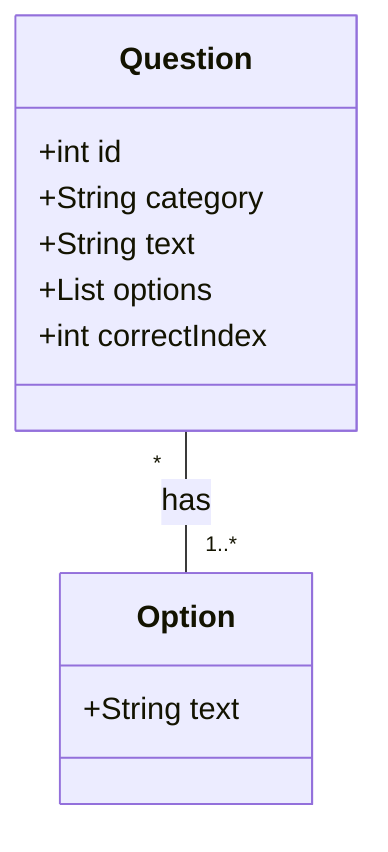

# Flutter GK Quiz App – Monetization Roadmap to ₹1,000/Month

**Executive Summary:** India’s mobile market is vast – with ~806 million internet users as of 2025 (≈55% penetration)【17†L55-L60】 – and even niche apps can reach critical mass.  By targeting a fraction of this audience (e.g. a few hundred Daily Active Users), a simple quiz app can cross ₹1,000/month in ad revenue.  We analyze a *General Knowledge (GK) Quiz* app (Flutter + GetX) for this purpose, justifying its market fit and revenue potential.  Using conservative Indian eCPM benchmarks (e.g. ~₹8 per 1K banner views, ~₹100 per 1K interstitials【29†L141-L149】), we show that ~300 DAU viewing a mix of banners/interstitials can achieve the goal.  This report covers the market rationale, audience, feature set (with MVP scope), user flows, UI/UX outlines, ad strategy (AdMob banners/interstitials/rewarded, placements, frequencies), user acquisition & retention tactics, analytics/events tracking, privacy and Play Store compliance. We also detail the full development plan: timeline (≈200–300 hours), tech stack/packages (Flutter, GetX, google_mobile_ads, etc.), minimal backend (no backend or Firebase for analytics), data models, project structure, CI/CD/testing strategy, and cost/revenue projections.  Finally, we provide a developer TODO list (VSCode/Antigravity) with exact commands, sample code snippets (e.g. GetX controllers, ad integration), and a prompt file with instructions for coding, testing, and Play Store submission. 

## Market Rationale & Target Audience  
India’s smartphone user base (hundreds of millions) and low usage barriers create opportunities for simple free apps.  GK Quiz apps tap into India’s strong education and competition culture (exam prep, trivia interest).  Users (age ~15–40, both students and lifelong learners) regularly seek quiz content for fun and skill-building.  A GK quiz app encourages daily opening (for new questions) and long sessions, supporting many ad impressions.  Advertisers pay modest rates in India, but sheer volume can cross revenue targets【29†L141-L149】.  For example, at eCPMs of ~$0.10 (₹8) for banners and ~$1.30 (₹104) for interstitials on Android【29†L141-L149】, each daily user generating ~3 ads (2 banners +1 interstitial) yields ≈₹0.12/day (~₹3.6/mo).  Thus ~300 daily users can net ~₹1,000/mo.  Even under a *conservative* scenario (100 DAU, mostly banner ads) the app would approach ₹500–₹800/month; a *realistic* scenario (300–500 DAU with mixed ads) easily exceeds ₹1,000【29†L141-L149】.  

Key market factors: India’s mobile data is affordable (enabling frequent use) and users expect free apps with ads.  Ad networks like Google AdMob dominate; we assume AdMob for its broad fill rate in India.  By focusing on a high-interest niche (daily GK quiz) and optimizing for engagement, we can attract the requisite DAU.  

## Core Features & MVP Scope  
The app’s core feature set is deliberately limited to achieve a quick launch (MVP) while solving the user’s need for daily quiz content.  **Core functionality:** 
- **Category Selection:** Screen listing GK categories (e.g. Science, History, Current Affairs, etc.), enabling user choice or random mix.  
- **Quiz Engine:** For the chosen category, present a sequence of multiple-choice questions (MCQs). Randomize questions each session; allow preset quiz length (e.g. 10 questions).  
- **Question Display:** Each question screen shows the question text, four (or more) answer options, and a “Next” button. UI includes a progress indicator and current score.  
- **Scoring & Results:** After the quiz, show total correct answers, percentage score, and perhaps correct answer review. Include “Play Again” and “Share” buttons.  
- **Ad Placements:** 
  - *Banner Ads:* Persistent banner at bottom of question and results screens (small constant revenue, non-intrusive).  
  - *Interstitial Ads:* Full-screen interstitial shown after finishing each quiz or after every few questions (high-value impressions).  
  - *Rewarded Ads (optional):* Offer a “watch ad for bonus question or hint” feature to increase monetizable impressions and engagement.  
- **Optional Features:** (deferred for MVP) User profiles or login (for saved high scores, streaks, social login), daily streak/bonus system, offline question database (for no-network usage).  

*MVP Feature List (table):*  

| Feature            | Purpose                              | Priority (MVP)   |
|--------------------|--------------------------------------|------------------|
| Category List      | User selects quiz topic              | High (Essential) |
| Question Screen    | Displays MCQ, tracks user answer     | High (Essential) |
| Answer Submission  | User taps answer; immediate feedback | High (Essential) |
| Scoring & Results  | Show score summary, correct answers  | High (Essential) |
| Banner Ad (Bottom) | Continuous passive monetization      | High (MVP)       |
| Interstitial Ad    | Monetize natural breaks (quiz end)   | High (MVP)       |
| Rewarded Ad Option | Optional bonus question/hint reward  | Medium           |
| Settings (optional)| Toggle sound, view About             | Low (MVP adv)    |
| Firebase Analytics | Track usage metrics                  | High (MVP)       |

Each core screen will be built using Flutter widgets with GetX for state management and routing.  The **minimum viable product** omits complex backend – questions can be hardcoded JSON or stored in assets for an initial launch.

## User Flow & Wireframe (Mermaid Diagram)  
The user journey from app launch to earning revenue through ads is as follows: they open the app, select a quiz category (or start a default quiz), answer the series of questions, view their results, and optionally re-play or share. Ads are shown unobtrusively during this flow.  

```mermaid
flowchart LR
    Start((App Launch)) --> Categories[{"Select Quiz Category"}]
    Categories --> Question1[{"Show Question 1"}]
    Question1 -->|Answer| Question2[{"Show Question 2"}]
    Question2 -->|...| QuestionN[{"Show Question N"}]
    QuestionN --> Results{"Display Score & Results"}
    Results --> End((Session End))
    End -->|Play Again| Categories
    End -->|Share| (External)
```

**UI/UX Wireframes:** 
- *Category Screen:* A simple list/grid of category cards (e.g. “Science”, “History”), each with an icon. Top AppBar with app name, bottom banner ad fixed.  
- *Quiz Screen:* Top shows question text; below, multiple answer buttons (radio or tile style). Progress indicator (e.g. “Question 3/10”) and current score in a header. Bottom has banner ad. On answer, show correct/incorrect highlight briefly before auto-advancing.  
- *Results Screen:* Bold display of “Your Score: X/Y”. Buttons for “Retry Quiz”, “Choose Category”, and “Share Score”. Also an interstitial ad triggers on arrival to this screen.  
- *General UX:* Clean, legible fonts (e.g. Google’s Roboto), consistent color theme (professional yet vibrant), easy touch targets. Ensure high contrast for readability. The UI flows are simple and minimal to reduce friction.

## Ad Strategy (Networks, Formats, Placement, eCPM)  
Our monetization strategy prioritizes AdMob (Google’s mobile ad network) due to its robust ecosystem and ease of integration with Flutter【26†L596-L604】.  We will implement:  
- **Ad Types:** Banner Ads (small rectangle at bottom of screen) for passive fill; Interstitial Ads (full-screen) to monetize transition points (after each quiz or every few questions)【29†L151-L154】; Rewarded Ads (optional) to incentivize extra engagement.  
- **Placement & Frequency:** A banner ad on most screens (category list, quiz questions, results). Interstitials shown after each completed quiz (or after 5 questions, whichever yields a better UX balance). Rewarded ads offered on Results screen as “Watch video for a bonus hint/extra question”. We cap interstitials to ~1 per minute per user to avoid fatigue.  
- **eCPM Assumptions (India):** Based on industry data, assume **Banner eCPM ≈ $0.10 (₹8) and Interstitial eCPM ≈ $1.30 (₹104) on Android**【29†L141-L149】.  Rewarded ads can be higher (often ~$2–3, say ₹160–240 per 1K views). These values match published AdMob benchmarks for India.  
- **AdRevenue Projection:** Using these, one interstitial yields ~₹0.10 to the publisher, one banner view ~₹0.008.  If each user sees ~2 banners + 1 interstitial/day, daily revenue per user ≈₹0.12 (₹4/month). Thus ~300 DAU produces ~₹1,000/mo.  We plan conservative and growth scenarios as follows:  

| Scenario    | DAU | Ads/User/Day               | Impr./Day        | Rev/Day (₹) | Rev/Month (₹) | Days to ₹1k |
|-------------|-----|----------------------------|------------------|-------------|---------------|-------------|
| Conservative| 100 | 1 banner                  | 100 banners      | ~0.80       | ~24           | >30         |
| Baseline    | 300 | 2 banners + 1 interstitial| 600 banners + 300 inters = 900| ~34.8     | ~1,044       | ~30         |
| Optimistic  |1000 | 2 banners + 1.5 inters    | 2000 banners +1500 inters = 3500| ~166  | ~4,980       | ~6          |

(*Estimates:* Banner =₹8/1K, Interstitial=₹104/1K.  Calculations show 300 DAU yields ~₹1,000/month, a reasonable target under “Baseline” usage.  Higher engagement (Optimistic) quickly surpasses that.)  

Given these benchmarks, focusing on driving DAU to 300+ is realistic in 1–2 months with low marketing spend (social media sharing, community outreach). We will continuously monitor eCPM trends (e.g., AnyMind’s report shows India’s interstitial eCPM has been rising)【28†L127-L132】 and adjust frequency accordingly.

## Retention & Growth Tactics  
To sustain revenue, we must keep users returning.  Key strategies include:  
- **Daily Notifications:** Send a timed push notification with a new quiz prompt (“New GK questions available!”). Personalized, value-driven notifications can dramatically improve day-1 and day-7 retention【34†L259-L262】.  
- **Gamification:** Implement daily streaks or point rewards to create habit. For example, award a “10-quiz streak” bonus or badge for consecutive days. Gamification (points, badges, leaderboards) and **incentivized ads** (extra question for rewarded video) are proven to boost engagement【32†L43-L45】.  
- **Social Sharing:** Allow sharing scores or fun facts via WhatsApp/Facebook to viral growth. Add “Share this quiz” or “Challenge a friend” features to leverage organic reach.  
- **Referral Incentives:** Consider a simple referral program (e.g., “Invite friend, get bonus life or coins” if we introduce any currency system).  
- **Content Updates:** Regularly add new questions or categories (e.g. current events, trending GK topics) to give users a reason to revisit.  
- **App Store Optimization:** Use relevant keywords (e.g. “GK Quiz”, “Quiz for Students”), localize app store listing to Hindi/English, and encourage user reviews (4+ stars) to improve visibility.  

By combining push notifications, gamification, and social features, we align with best practices for retention: “push notifications and rewards can significantly reduce churn”【34†L259-L262】【32†L43-L45】. Tracking D1/D7 retention will be our KPI to gauge success.

## Analytics & Event Tracking  
We will integrate Firebase Analytics to measure usage and revenue metrics【39†L719-L727】. Key events to log include: 
- **App_Open** (when user launches app).  
- **Quiz_Start** (when a user begins a quiz).  
- **Question_Answered** (each answer, with correctness parameter).  
- **Quiz_Complete** (with score and duration).  
- **Ad_Viewed** (banner, interstitial, rewarded ads; track impression and click events).  
- **Share_Click** and **Invite_Sent** (social/referral actions).  

Analytics will also log user properties (e.g. app version, device language) and funnel data (e.g. how many users drop off before finishing a quiz).  Recommended practice from Google: “Log these recommended events with parameters to benefit from full insights”【39†L719-L727】. Using `firebase_analytics` plugin, we will call `FirebaseAnalytics.instance.logEvent(name:..., parameters:{...})` at each trigger.  This data will inform us if, for example, user engagement drops off at question 3, or if interstitials hurt retention.

## Privacy, Consent & Play Store Compliance  
We must comply with Google Play policies and data laws. Since our app will serve ads and may collect analytics: 
- **Data Safety Form:** We will complete the Play Store “Data Safety” section, declaring use of Analytics and the Advertising ID【42†L69-L77】.  
- **Privacy Policy:** Publish a privacy policy (linkable in the app and Play listing) explaining data collection (analytics, Ad ID for personalized ads) and ad network usage.  
- **Advertising ID Consent:** With Android 13+, apps must explicitly request the AD_ID permission to access the advertising ID【42†L69-L77】. Our AdMob plugin (SDK 20.4.0+) handles this automatically【42†L69-L77】.  
- **Children’s Policy:** If any category is kid-oriented (not the case here), we would need to tag under age and ensure no personalized ads or IDs are sent. Otherwise, general adult audience policy applies.  
- **AdMob Policies:** Follow AdMob placement rules (no accidental clicks, “X” to close interstitial, no ads on app open until content is visible). The official cookbook advises registering actual Ad Unit IDs to avoid test ads【46†L843-L852】.  
- **Permission Declaration:** We declare only minimal permissions (INTERNET, ACCESS_NETWORK_STATE for ads/analytics). No personal user data is collected, so no need for contacts or location permissions.  

By adhering to Google’s guidelines – e.g. not sending AD_ID for children and completing the disclosure form【42†L83-L91】【42†L69-L77】 – we ensure smooth Play Store approval.

## Tech Stack, Architecture & Packages  
**Flutter & GetX:** We use Flutter (current stable, e.g. 3.x) for cross-platform UI【24†L59-L64】. For state management, routing, and DI, we use the GetX package: “GetX is an extra-light and powerful solution for Flutter, combining high-performance state management, intelligent dependency injection, and route management”【22†L131-L133】. Its reactive approach and simple syntax can “save hours of development”【22†L141-L144】.  
**Key Packages:** 
- `get` (GetX for state/route/DI)【22†L131-L133】, 
- `google_mobile_ads` (official Google Mobile Ads SDK)【26†L596-L604】【46†L761-L770】, 
- `firebase_analytics` (for Analytics)【39†L743-L751】【39†L757-L765】, 
- (Optional) `flutter_local_notifications` for push (or use Firebase Cloud Messaging).  
- (Optional) `get_storage` or `shared_preferences` for lightweight local persistence (storing high score).  

**Architecture:** We will follow an MVC/MVVM-like separation. Folders: 
```
lib/
  main.dart
  app/
    routes.dart      // GetX route definitions
    bindings/        // Binding classes
    controllers/     // GetX Controllers (QuizController, etc.)
    models/          // Data models (Question, Option, Score)
    views/           // Widget pages (CategoryPage, QuizPage, ResultPage)
    services/        // (e.g., AdService, AnalyticsService)
    utils/           // Helpers (constants, theme, etc.)
assets/
  data/
    questions.json   // (MVP) list of quiz questions
```
Each view has an accompanying controller, connected via GetX Binding. This clean separation ensures maintainable, testable code. For example, **QuizController** (GetxController) will hold reactive variables like `RxInt score` and methods to advance questions; it is bound to `QuizPage` via a `QuizBinding` class.  

**Backend Needs:** None strictly required for MVP. All question data can live locally in JSON assets. For future updates, one could use Firebase Firestore or a private API to fetch new questions; but initial version assumes no backend. We’ll use Firebase only for Analytics (no user-auth or database).  

## Data Model (Mermaid Class Diagram)  
Primary data entities: **Question** and **Option**. Each Question has multiple Option choices and a correct answer index. We optionally track **UserScore** or session stats in-app.  



This illustrates: a `Question` (with fields like `id`, `text`, `options[]`, `correctIndex`) has many `Option` texts.  We may also define a lightweight `UserScore` object to hold the user’s score per quiz, but that can be managed in controller state.

## Development Timeline & Effort  
We estimate **200–300 person-hours** (≈1–2 months) for a solo mid-level Flutter developer to build the MVP and launch. This includes design, development, testing, and deployment. Phases: 

- **Week 1 (40h):** Requirements, wireframes, UI design sketches (Flutter widgets structure), setting up project (Flutter SDK install, VSCode with Flutter plugin), integrating GetX, stub views (CategoryPage, QuizPage, ResultPage). Create pubspec with packages (`flutter pub add get google_mobile_ads firebase_analytics` etc).  
- **Week 2 (40h):** Implement QuizController and data models; load question list from assets; develop question navigation logic. Basic styling of UI. Testing of quiz flow with mock data.  
- **Week 3 (40h):** Integrate Google Mobile Ads: add AdMob App IDs in AndroidManifest/iOS Info.plist (as per official docs【46†L709-L718】), initialize SDK (`MobileAds.instance.initialize()`【46†L722-L731】), implement BannerAd and InterstitialAd in code (e.g. using the snippet from Flutter cookbook【46†L761-L770】). Test with test ad units.  
- **Week 4 (40h):** Set up Firebase Analytics and logging events in key places. Implement push notification scheduling (if using FCM). Polish UI. Internal testing and bug-fixing.  
- **Week 5-6 (40h):** Beta testing (via Firebase App Distribution or closed group), fix issues. Prepare Play Store listing (screenshots, app description). Ensure Privacy Policy URL (can be a simple web page). Handle final compliance checklist.  
- **Week 7 (40h):** Submit to Play Store and address feedback. Work on minor improvements and start content update pipeline (if adding new questions).  

A **CI/CD and testing plan** will enforce code quality:  
- **Version Control:** Git with branch strategy (feature branches, a `develop` branch).  
- **CI:** Use GitHub Actions or Codemagic to run `flutter analyze`, `flutter test` on each push.  
- **Testing:** Write unit tests for `QuizController` logic and `Question` model. Use widget tests for key pages (e.g. ensure CategoryPage renders buttons).  
- **CD:** Optionally automate APK build with GitHub Actions on merges. Use Firebase App Distribution for QA.  
- **Play Store:** Ensure app meets Google’s requirements (target latest SDK, 64-bit support, etc.).  

## Cost and Revenue Projection (Assumptions)  
**Costs:** Mainly developer time (say ₹1,000/hour as opportunity cost; 200h→₹200k labor) plus minimal app store listing cost (₹250 initial fee). No server costs for MVP (static content).  

**Revenue:** Primary revenue is ads. Assuming the Baseline scenario (300 DAU, mix of banners/interstitials): ~₹1,000/month at launch【29†L141-L149】.  We conservatively forecast:  
- **Month 1:** 300 DAU → ~₹1,000.  
- **Month 3:** 600 DAU (with marketing push) → ~₹2,400/month.  
- **Month 6:** 1,000 DAU → ~₹4,000/month.  

(These are illustrative; actual eCPMs and fill rates may vary, but aligned with industry data【29†L141-L149】.) We do **not** plan paid features, only ad revenue. The main metric is Days to ₹1,000: at baseline, ~30 days; at growth, just a few days once scale is reached.

## Developer TODO List (VSCode/Antigravity)  

1. **Create Flutter project:** Open terminal, run:  
   ```
   flutter create quiz_app
   cd quiz_app
   ```  
   Then open in VSCode (or Antigravity IDE).  
2. **Add dependencies:** In `pubspec.yaml`, under `dependencies:`, add:  
   - `get: ^4.6.5` (GetX)  
   - `google_mobile_ads: ^2.3.0` (Google Mobile Ads)  
   - `firebase_analytics: ^10.0.0` (Firebase Analytics)  
   Also add (optional) `flutter_local_notifications` if needed. Save and run `flutter pub get`.  
3. **Set up GetX:** Create folder `lib/app/`, and files:  
   - `app/routes.dart` – define `GetPage(name: '/', page:()=>CategoryPage(), binding: CategoryBinding())`, etc.  
   - `app/bindings/CategoryBinding.dart` with `void dependencies() => Get.lazyPut<CategoryController>(()=>CategoryController());` (similar for `QuizBinding`, `ResultBinding`).  
   - In `main.dart`, wrap app with `GetMaterialApp(initialRoute: '/', getPages: Routes.pages)`.  
4. **Design Data Models:** Create `lib/app/models/Question.dart`:  
   ```dart
   class Question {
     final int id;
     final String category;
     final String question;
     final List<String> options;
     final int correctIndex;
     Question({required this.id, required this.category, required this.question, required this.options, required this.correctIndex});
     // fromJson factory if using JSON
   }
   ```  
   (Also create an `Option` model if needed, or use List<String> directly.)  
5. **Implement Controllers (GetxController):** For example, `QuizController`:  
   ```dart
   class QuizController extends GetxController {
     RxInt currentIndex = 0.obs;
     RxInt score = 0.obs;
     List<Question> questions = [...]; // load from JSON asset
     void answer(int selectedIndex) {
       if (questions[currentIndex.value].correctIndex == selectedIndex) score++;
       currentIndex++;
     }
   }
   ```  
   Create `ResultController` to manage final score.  Use `.obs` for reactive state.  
6. **Build UI Views:**  
   - **CategoryPage:** Scaffold with AppBar(title: "GK Quiz"), body: list of category buttons. On tap, navigate: `Get.toNamed('/quiz', arguments: category)`.  
   - **QuizPage:** Scaffold; in body, use `Obx(() => Column( ... question text ... List of answer buttons ...) )`.  Each answer button calls `controller.answer(index)` and if last question reached, navigate to ResultPage with interstitial.  
   - **ResultPage:** Show score via `controller.score.value`, offer buttons `Retry` (`Get.offNamed('/quiz')`) and `Exit`.  
   Use `GetView<Controller>` classes for easy binding.  
7. **Integrate Ads (GoogleMobileAds):**  
   - In `android/app/src/main/AndroidManifest.xml`, add:  
     ```xml
       <meta-data
           android:name="com.google.android.gms.ads.APPLICATION_ID"
           android:value="ca-app-pub-XXXXXXXXXXXXXXXX~YYYYYYYYYY"/>
     ```  
   - In `main()`, initialize:  
     ```dart
     void main() async {
       WidgetsFlutterBinding.ensureInitialized();
       await MobileAds.instance.initialize();
       runApp(MyApp());
     }
     ```  
   - **Banner Ad Code Snippet:** (in a widget)  
     ```dart
     final BannerAd banner = BannerAd(
       adUnitId: '<YOUR-BANNER-AD-UNIT-ID>',
       size: AdSize.banner,
       request: AdRequest(),
       listener: BannerAdListener(
         onAdLoaded: (_) => print('Banner ad loaded'),
         onAdFailedToLoad: (ad, err) { ad.dispose(); print(err.message); },
       ),
     );
     banner.load();
     ```  
     Show with an `AdWidget`:  
     ```dart
     Widget build(BuildContext context) {
       return SizedBox(
         height: banner.size.height.toDouble(),
         child: AdWidget(ad: banner),
       );
     }
     ```  
   - **Interstitial Ad Snippet:**  
     ```dart
     InterstitialAd.load(
       adUnitId: '<YOUR-INTERSTITIAL-AD-UNIT-ID>',
       request: AdRequest(),
       adLoadCallback: InterstitialAdLoadCallback(
         onAdLoaded: (InterstitialAd ad) {
           ad.fullScreenContentCallback = FullScreenContentCallback(onAdDismissedFullScreenContent: (ad) => ad.dispose());
           ad.show();
         },
         onAdFailedToLoad: (LoadAdError error) { print(error.message); },
       ),
     );
     ```  
   Test ads first (use Google’s test IDs or set `request: AdRequest(testDevices: ['SIMULATOR'])`).  
8. **Analytics Logging:** In each controller action, log events:  
   ```dart
   FirebaseAnalytics analytics = FirebaseAnalytics.instance;
   // e.g., on quiz start:
   analytics.logEvent(name: 'quiz_start', parameters: {'category': selectedCategory});
   // on answer:
   analytics.logEvent(name: 'question_answered', parameters: {'correct': isCorrect});
   ```  
   Follow Google’s guidance【39†L719-L727】 to use `logEvent`.  
9. **Testing & Debugging:** Write unit tests in `test/` for:  
   - `QuizController.answer()` increments score correctly.  
   - `Question` parsing from JSON works.  
   Run `flutter test` to ensure logic is correct.  In debug mode, test ad callbacks and UI flows. Use Flutter DevTools for performance profiling.  
10. **Prepare Store Listing:** Collect screenshots of CategoryPage, QuizPage, ResultPage. Write Play Store descriptions (mention “Free GK Quiz App”, “Daily Trivia”, etc.). Create a Privacy Policy (GitHub Pages or Firebase Hosting). Ensure manifest has correct `uses-feature` and API target (target Android 13+).  
11. **Build & Release:** Run `flutter build appbundle --release`. Upload to Google Play Console. For initial release, select 100% countries or target India/English locales.  
12. **Monitor & Optimize:** After launch, monitor Crashlytics (if added) and analytics for retention/DAU. Adjust ad frequency (via AdMob’s dashboard) based on user behavior. Iterate on content and features in agile sprints.  

## Developer Prompt File (for code generation, testing, submission)

```
# Environment & Project Setup
Prompt: "Initialize a new Flutter project with GetX. Use command:
flutter create --org com.example.gkquiz quiz_app"
====
# Dependencies Installation
Prompt: "In pubspec.yaml, add dependencies: get, google_mobile_ads, firebase_analytics. Then run flutter pub get."
====
# AdMob Configuration
Prompt: "In AndroidManifest.xml, add your AdMob App ID meta-data entry under <application>. In iOS Info.plist, add GADApplicationIdentifier key."
====
# GetX Routing and Bindings
Prompt: "Define routes in lib/app/routes.dart using GetPage. Create bindings classes (CategoryBinding, QuizBinding) in lib/app/bindings to connect controllers."
====
# Data Model Generation
Prompt: "Generate a Dart class Question with fields: id, category, text, List<String> options, int correctIndex. Include fromJson constructor if needed."
====
# Controller Code Generation
Prompt: "Write QuizController (extends GetxController) with RxInt currentIndex and score. Implement answer(selectedIndex) to update score and index."
====
# UI Code Generation
Prompt: "Create Flutter widgets: CategoryPage (list of category buttons), QuizPage (Obx widget showing current question and answer buttons), ResultPage (show final score). Use GetView<> for each with corresponding controllers."
====
# Ad Integration Code
Prompt: "Write Dart code to initialize MobileAds in main(), and code to load BannerAd and InterstitialAd as per Google’s recipe (use BannerAdListener)."
====
# Analytics Integration Code
Prompt: "Add firebase_analytics: initialize in main(), and use analytics.logEvent in controllers (e.g. logEvent('quiz_complete', {'score':score}))."
====
# Testing Code
Prompt: "Write a unit test for QuizController: simulate answering questions and assert that score matches expected."
====
# Debugging Tips
Prompt: "If banner ads fail to load, check log output. Ensure app IDs and Ad Unit IDs are correct. Use Flutter DevTools for inspecting widget tree."
====
# Play Store Submission Checklist
Prompt: "Checklist: have screenshots for all relevant screens, set correct app category and keywords, include privacy policy URL, declare data safety (analytics, advertising ID). Ensure app meets all policy requirements before submission."
```